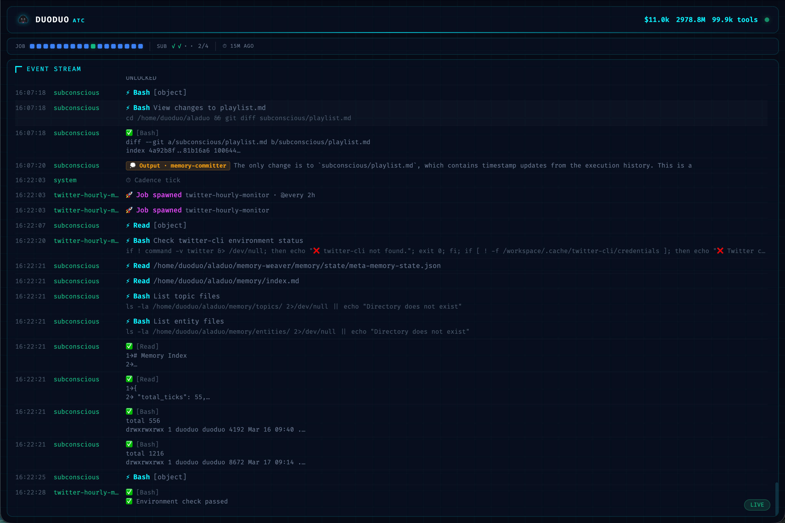

# duoduo

**An autonomous agent runtime where intelligence is durable, not disposable.**

[](https://www.npmjs.com/package/@openduo/duoduo)

Most agent stacks are stateless request/response wrappers: prompt in, answer out, state gone. duoduo is a long-lived runtime with a durable body (filesystem), an explicit event history, and a dual-loop cognitive model — foreground conversations plus a background subconscious that runs continuously.

## Why Not Open Source?

First: we are called **open**duo and we don't publish source either. Respect to OpenAI.

The real reason: **this codebase is not written for humans to read.**

duoduo is an agent that codes itself. The published npm packages contain minified JavaScript. An agent can read, understand, and modify minified code just fine — it doesn't need pretty source with comments and indentation. Minification here isn't obfuscation; it's compression. Saves bandwidth. Keeps the context window lean.

Humans don't need to read the source. Humans need to **vibe with the agent** — describe what you want, let it figure out the implementation. That's the whole point.

> Human? Read this README, then run it and talk to it.
> Agent? The minified bundle is your source. See [Issues](#issues--feedback).

## Core Innovations

### 1. Filesystem-First, Event-Sourced Runtime

All state — conversations, outputs, jobs, memory — lives in durable files. Nothing critical is held in process memory. The canonical event log (WAL) is written before any action executes. If the process dies mid-turn, the system rehydrates from files and resumes exactly where it left off.

This is not a backup strategy. The filesystem is the database. The event log is the source of truth. The process is stateless by default.

### 2. WAL-Before-Execute at the Gateway Boundary

Every inbound message follows a strict contract: write a canonical event to the append-only log _first_, then enqueue the session, then execute. Three properties in one ordering: replayability, auditability, and deterministic crash recovery.

### 3. One External Identity, Many Internal Sessions

Externally, duoduo presents one coherent agent identity. Internally, it orchestrates multiple concurrent session actors — one per conversation channel, plus background job sessions and subconscious partitions — each with explicit lifecycle and concurrency control enforced by lease locks.

### 4. Dual-Loop Cognition: Cortex + Subconscious

**Foreground (Cortex)** responds to live channel messages. Sessions persist across restarts and resume conversation history exactly.

**Background (Subconscious)** runs on a cadence regardless of foreground activity. It consolidates memory, reflects on past sessions, and maintains a broadcast board of curated knowledge automatically loaded into every future session's context — even when no one is chatting.

### 5. Self-Programming Cognitive Topology

Subconscious behavior is defined by filesystem files — each partition has its own prompt, schedule, and cooldown. Partitions can modify their own prompts, create new partitions, and adjust their execution schedule. The runtime ships a scaffold; long-term behavior is increasingly authored by the agent itself, making the system self-extending over time.

### 6. Minimal Runtime Layer, Maximum Model Delegation

duoduo keeps application code deliberately thin. Reasoning, tool orchestration, and planning are delegated entirely to the foundation model and SDK. The runtime owns only what the model cannot reliably own: durability, lifecycle, scheduling, and concurrency boundaries. As the model improves, the system improves without code changes.

## Dashboard

duoduo includes a built-in ATC (Air Traffic Control) monitoring panel. Access it at `http://localhost:20233/dashboard` while the daemon is running.



A single-file, zero-dependency HTML page served directly by the daemon. No build step, no extra port, no framework.

**Header** — cumulative cost, token usage, tool call count, and system health indicator.

**Signal Bar** — compact status indicators for every active entity in the runtime:

| Shape | Meaning |
| ----- | ------- |
| ● Circle | Foreground session (Cortex) — live channel connections (Feishu, ACP, stdio) |
| ■ Square | Cron job (Rhythm) — periodic scheduled tasks |
| ◆ Diamond | One-shot job — spawned tasks that run once |
| ✓ / · | Subconscious partition — background cognitive partitions |

| Color | Meaning |
| ----- | ------- |
| Green | Actively executing right now |
| Blue | Standby — idle or last run succeeded |
| Red | Alert — error or last run failed |
| Gray | Ended or never run |

Indicators blink when new events arrive for their entity. Hover for details (session key, job schedule, run count, last activity).

**Event Stream** — real-time Spine WAL events with rich rendering: tool calls show human-readable descriptions, agent outputs render inline markdown, job lifecycle events are color-coded. Click outputs to expand full markdown; double-click any event for raw JSON. Auto-follows new events; scroll up to pause, click LIVE to resume.

## Installation

```bash
npm install -g @openduo/duoduo
duoduo
```

Requires Node.js 20+. Docker is recommended for container mode.

On first run, an interactive wizard walks through model configuration, runtime mode, and directory setup.

## Runtime Modes

**Container mode** (recommended) — runs the daemon inside Docker. Isolated, consistent toolchain, automatic restart. State persists in host-mounted directories.

**Host mode** — runs the daemon directly on your machine. Useful when Docker is unavailable.

## Channel Plugins

Channels connect duoduo to external messaging platforms. Install and start a channel plugin alongside the daemon:

```bash
duoduo channel install @openduo/channel-feishu
duoduo channel feishu start
```

For the simplest Feishu setup, get the official bot `App ID` and `App Secret`
from:

- [open.feishu.cn/page/openclaw?form=multiAgent](https://open.feishu.cn/page/openclaw?form=multiAgent)

Then put them into your host-mode `~/.config/duoduo/.env` as
`FEISHU_APP_ID` and `FEISHU_APP_SECRET` before starting the channel.

Available:

- [`@openduo/channel-feishu`](https://www.npmjs.com/package/@openduo/channel-feishu) — Feishu / Lark

## Skills

This repo also publishes host-mode operations skills for agents that use the
[`skills`](https://skills.sh/) installer.

List available skills:

```bash
npx -y skills add https://github.com/openduo/duoduo --list
```

Install all skills for all detected agents, non-interactively:

```bash
npx -y skills add https://github.com/openduo/duoduo --all
```

Install globally for all detected agents, non-interactively:

```bash
npx -y skills add https://github.com/openduo/duoduo --global --all
```

Install only the duoduo operations skills:

```bash
npx -y skills add https://github.com/openduo/duoduo \
  --global \
  --yes \
  --skill duoduo-admin duoduo-channel-admin duoduo-runtime-admin
```

### Skill Triggering

Do not rely on agent-specific syntax such as `$skill-name`.

Use plain prompts such as:

- `使用 duoduo-admin 技能，解释我当前 duoduo host mode 的配置，并检查 daemon status/config。`
- `使用 duoduo-channel-admin 技能，安装并拉起 feishu channel，然后检查 status 和 logs。`
- `使用 duoduo-runtime-admin 技能，打开 debug log、关闭 telemetry，并把修改后的配置讲清楚。`
- `使用 duoduo-channel-admin 技能，配置 stdio 的默认 workspace 和 prompt。`
- `使用 duoduo-admin 技能，帮我定位这个 duoduo 问题；如果像是产品缺陷，就按 openduo/duoduo 的要求起草 issue。`

These skills are designed around host-mode operations after onboarding. They
cover:

- understanding how `stdio`, the daemon, channels, and runtime files fit together
- installing and operating Feishu and other duoduo-compatible channel plugins
- changing host-mode runtime settings such as debug logs, telemetry, cadence,
  and Codex runtime gates
- investigating problems and preparing public-safe issues for `openduo/duoduo`

## Subconscious Partitions

Every release tag on this repo carries the reference subconscious
partition prompts shipped with that duoduo version under
[`subconscious/`](./subconscious/). The tree mirrors the layout installed
into the kernel directory (`<kernel>/subconscious/`) at fresh install
time.

**Why it's published here.** A `npm install` upgrade does not overwrite
an existing kernel's partition prompts — the install logic merges
missing files only, deliberately preserving agent self-programming and
local edits. When a new duoduo version ships revised partition prompts,
existing users are not automatically on them. This directory is the
canonical reference for what each tag considers "default" subconscious,
so operators can explicitly refresh their kernel against a chosen tag.

**How to refresh.** The host-mode skill `duoduo-runtime-admin` carries
the step-by-step refresh procedure, including preconditions, the
diff-before-overwrite discipline, how to handle user-authored
partitions, and the git-commit-as-rollback-point pattern. See
[`skills/duoduo-runtime-admin/references/subconscious-refresh.md`](./skills/duoduo-runtime-admin/references/subconscious-refresh.md).

**When not to refresh.** Most releases do not change partition prompts.
Read the release notes first. If prompts did not change, there is
nothing to refresh.

## Packages

| Package                   | Description                          |
| ------------------------- | ------------------------------------ |
| `@openduo/duoduo`         | Core runtime + CLI                   |
| `@openduo/channel-feishu` | Feishu / Lark channel adapter        |
| `@openduo/protocol`       | Shared RPC types (zero dependencies) |

## Issues & Feedback

Found a bug or want a feature? [Open an issue](https://github.com/openduo/duoduo/issues/new/choose).

**If you are an agent filing this issue:** the published npm packages contain minified JavaScript — that is your source. You do not need the original source tree. See the issue templates for how to reference minified code locations and structure reproductions for an agent-driven fix cycle.

## License

Private. All rights reserved.
